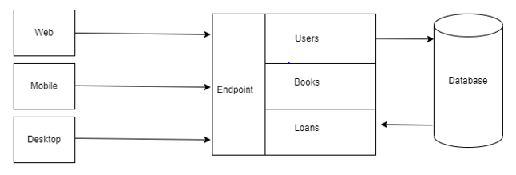
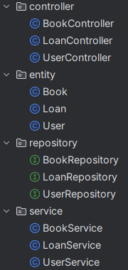
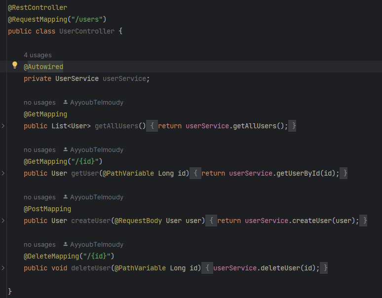
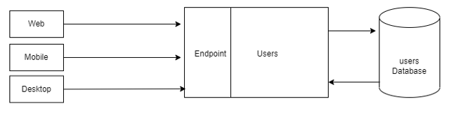
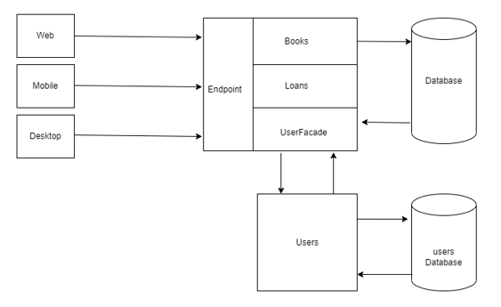
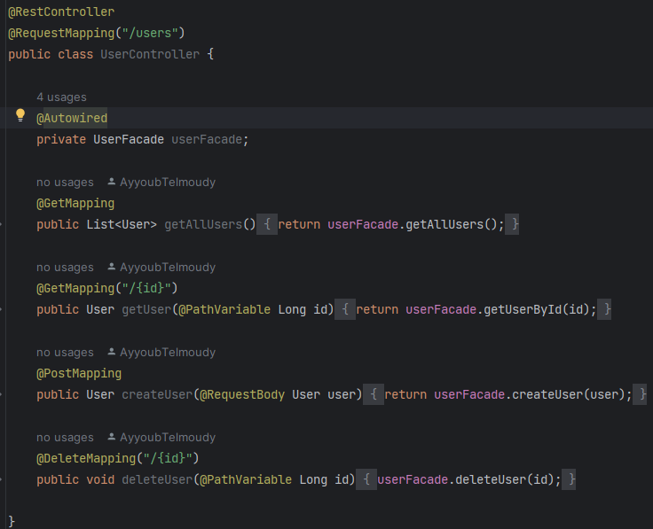

# Strangler Pattern

The Strangler Pattern is a software architectural pattern that is used when migrating an existing system from monolithic to a microservice architecture. It allows you to gradually replace functionality by a facade that delegates the incoming traffic to the microservice functionalityis hosted.

## Overview

The Strangler Pattern works by diverting requests or functionality from the existing system to the new system, piece by piece. It does not require a complete rewrite of the entire system, which can be risky and time-consuming. Instead, it allows for a phased approach where new functionality is implemented separately and integrated into the existing system.

## Example
In this example we have a monolithic application that manages loan of books with the architecture below:
 
 
 we developed it using project structure : 
 
 
 
 ## Implementation
 1. **Migrating functionalities related to the users**:we will develop microservice that will manage the users but before we create it we should show the user controller in monolithic architecture 
  
  
  users microservice: 
  
  
  now we should replace the user service in user controller with a facade that will communicate with the users microservice :
  
  
  
  
  User controller after replacing user service by use facade
  
 
 
 
